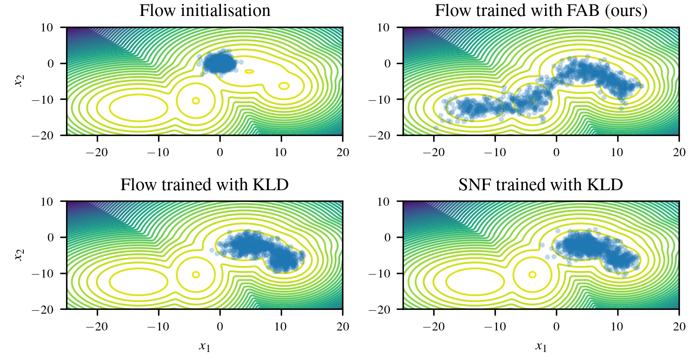
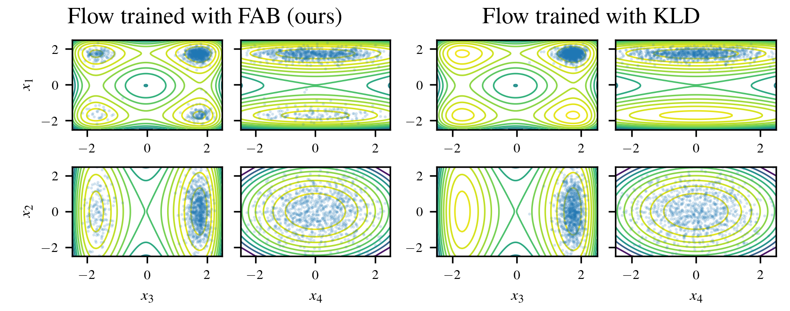

# Flow Annealed Importance Sampling Bootstrap (FAB)
## Ellis Workshop / arXiv Paper
By Laurence Illing Midgley, Vincent Stimper, Gregor N. C. Simm and José Miguel Hernández-Lobato. 

### Mixture of Gaussians Problem
 - [Notebook](https://github.com/lollcat/FAB-2021/blob/ToyProblems/FAB_ellis_paper/MoG/MoG.ipynb) for training FAB, and NF
 - [Notebook](https://github.com/lollcat/FAB-2021/blob/ToyProblems/FAB_ellis_paper/MoG/SFNsipynb.ipynb) for training SNF
 - [Notebook](https://github.com/lollcat/FAB-2021/blob/ToyProblems/FAB_ellis_paper/MoG/Plots.ipynb) for plotting results

### "Many Well" Problem
 - [Notebook](https://github.com/lollcat/FAB-2021/blob/ToyProblems/FAB_ellis_paper/ManyWell/Workshop_run_FAB.ipynb) for training FAB
 - [Notebook](https://github.com/lollcat/FAB-2021/blob/ToyProblems/FAB_ellis_paper/ManyWell/Workshop_run_NF.ipynb) for training a standard normalising flow with KL-divergence
 - [Notebook](https://github.com/lollcat/FAB-2021/blob/ToyProblems/FAB_ellis_paper/ManyWell/FAB_vs_NF.ipynb) for plotting results

## Notes on the code
 - See [here](https://github.com/lollcat/FAB-2021/blob/1c02d44ecbc295c952e64b89fbbfc735dfc9333f/AIS_train/train_AIS.py#L334) for the function that calculates the FAB loss, given the importance weights. 
 - I am currently working on creating cleaner implementations of FAB See [FAB-Torch](https://github.com/lollcat/FAB-TORCH) and [FAB-JAX](https://github.com/lollcat/FAB-JAX). 

## MPhil Thesis
[Report](https://github.com/lollcat/FAB-MPHIL-2021/blob/ToyProblems/LaurenceMidgley_Dissertation.pdf)

### Abstract
How can we approximate expectations over a target distribution (the target) that we cannot sample from? 
Two major approaches are Markov chain Monte Carlo (MCMC) and importance sampling. 
MCMC, the current state-of-the-art, generates samples in a Markov chain that converges to the target, which we can use for approximation by Monte Carlo (MC)
estimation. 
To obtain unbiased estimates, MCMC has to converge, which often requires long simulations. 
In importance sampling, we rewrite the desired expectation to be over a proposal distribution (the proposal), allowing us to compute an unbiased MC estimate using samples from the proposal. 
If we can obtain a proposal similar to the target, this allows us to perform fast approximate inference. 
However, there are two challenges to such an approach: (1) if the proposal is not sufficiently expressive, it will not be able to capture the target’s shape and (2) training the proposal is exceedingly difficult without samples from the target.

In this work, we combine importance sampling and MCMC in a method that leverages the advantages of both approaches. We use annealed importance sampling (AIS), whereby we generate samples from the proposal and then move, via MCMC, through a sequence of intermediate distributions to provide samples closer to the target. AIS preserves the ability to compute importance sampling estimates, while lowering the variance of this estimate (relative to only using the proposal). 
Furthermore, the MCMC transitions within AIS do not have to converge for this estimate to be unbiased, and therefore can be computationally cheaper than pure MCMC. 
Additionally, we use a normalising flow model (the flow) for the proposal, which is a highly expressive, parameterised distribution that has the potential to
capture the shape of complex targets. 
Together the flow-AIS combination provides a way to generate samples close to the target, overcoming the expressiveness barrier to importance
sampling methods. 
To train the flow-AIS combination, we propose FAB (normalising Flow
AIS Bootstrap): a novel training method that allows the flow and AIS to improve each
other in a bootstrapping manner. We demonstrate that FAB can be used to produce accurate
approximations to complex target distributions using toy problems (including the Boltzmann
distribution), where conventional methods of training importance samplers fail.
